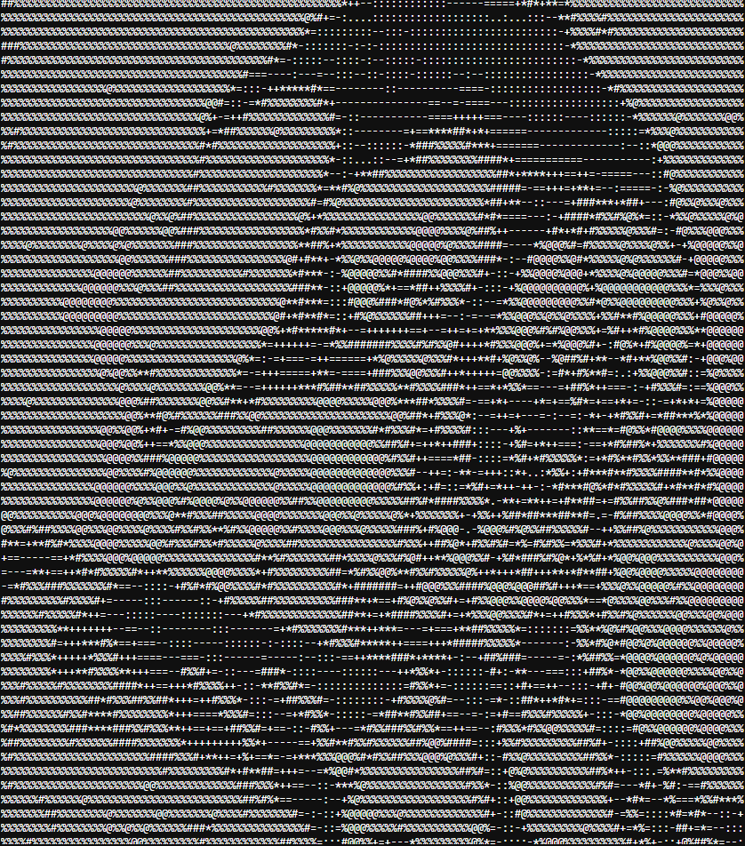
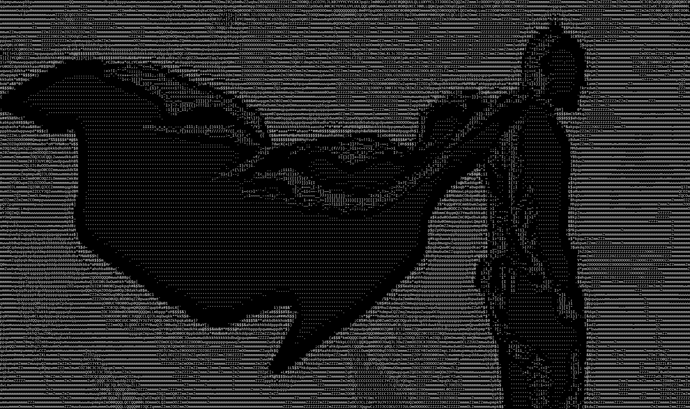
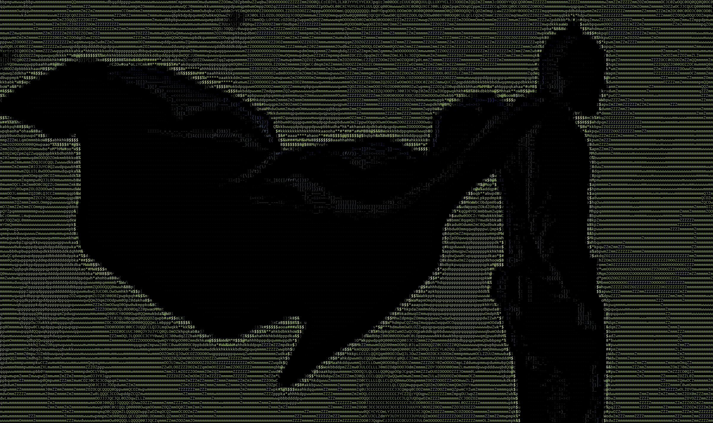

<h1 align="center">Asciii</h1>

<p align="center">
An image-to-ASCII converter with black & white (.txt) and colored (.html) exports.
</p>

<div align="center">


</div>

---

## Features

- **Grayscale text output** — saves ASCII art to a `.txt` file using a 10-level character ramp (`@ % # * + = - : .`)
- **Colorized HTML output** — generates a self-contained `.html` file where each character is tinted with the original pixel color
- **Aspect ratio correction** — automatically adjusts row count for monospace font proportions so the result looks natural in terminals and editors
- **Configurable width** — control output detail by setting the character width (default: 100 columns)
- **Simple API** — use as a script or import the functions in your own Python projects
- **No external assets** — HTML output is a single file with inline CSS; open it directly in any browser

## How It Works ?

1. The input image is resized to a target width while preserving aspect ratio (with a 0.55 height factor to compensate for tall monospace characters).
2. Each pixel's brightness is mapped to one of 10 ASCII characters, from darkest (`@`) to lightest (space).
3. For HTML output, the same character is wrapped in a colored `<span>` using the pixel's original RGB values.

## Requirements

- Python 3.7+
- [Pillow](https://pypi.org/project/Pillow/) (PIL)

## Installation

1. Clone or download this repository:

```bash
git clone https://github.com/millixs/Asciii.git
cd Asciii
```

2. Install the dependency:

```bash
pip install Pillow
```

## Usage

### Quick start

Place your image in the project folder (e.g. `input.jpg`), then run:

```bash
python ascii.py
```

By default this produces:

| File | Description |
|------|-------------|
| `ascii_image.txt` | Grayscale ASCII art (120 columns wide) |
| `ascii_image.html` | Colorized ASCII art (120 columns wide) |

Edit the bottom of `ascii.py` to change the input file or width:

```python
if __name__ == "__main__":
    image_to_ascii("input.jpg", new_width=120)
    image_to_ascii_color("input.jpg", new_width=120)
```

### As a Python module

```python
from ascii import image_to_ascii, image_to_ascii_color

# Grayscale text file
image_to_ascii("photo.png", output_file="output.txt", new_width=150)

# Colorized HTML file
image_to_ascii_color("photo.png", output_file_html="output.html", new_width=150)
```

### Viewing the output

- **Text (`.txt`)** — open in any editor or terminal with a **monospace font** (e.g. Consolas, Cascadia Mono, Fira Code). Proportional fonts will distort the image.
- **HTML (`.html`)** — open in a web browser for the best result; colors and proportions are handled automatically.

## Screenshots

### Grayscale text output

ASCII art rendered as plain text in a monospace editor:



### Colorized HTML output

The same image converted to colored ASCII art in the browser:



## Project Structure

```
Asciii/
├── ascii.py            # Main script and conversion logic
├── input.jpg           # Sample input image
├── ascii_image.txt     # Generated grayscale output
├── ascii_image.html    # Generated colorized output
├── screenshots/        # Example output screenshots
│   ├── 1.png
│   └── 2.png
└── README.md
```

## Supported Image Formats

Any format supported by Pillow works out of the box, including:

- JPEG (`.jpg`, `.jpeg`)
- PNG (`.png`)
- BMP (`.bmp`)
- GIF (`.gif`)
- WebP (`.webp`)
- TIFF (`.tiff`)

## Tips

- **Higher `new_width`** = more detail, but larger files and slower rendering.
- **Lower `new_width`** = faster and smaller, but less recognizable.
- For portraits and detailed photos, `100–150` columns is a good starting range.
- The HTML output preserves original colors and is usually the most visually accurate format.

## License

This project is open source. 
